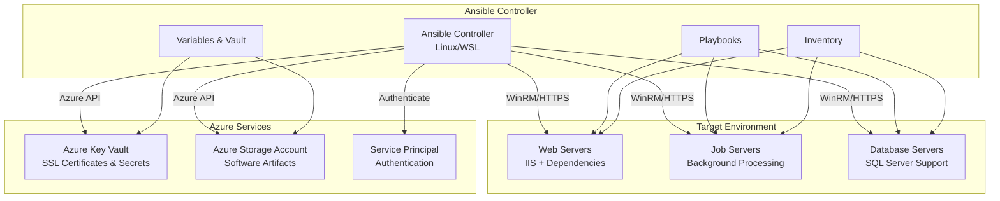

# Ansible Windows Azure Automation

[](https://opensource.org/licenses/MIT)
[](https://www.ansible.com/)
[](https://www.ansible.com/)
[](https://www.microsoft.com/en-us/windows-server/)
[](https://azure.microsoft.com/)

> **Enterprise-grade Ansible automation for Windows Server environments with Azure integration**

## 📋 Table of Contents

- [Overview](#-overview)
- [Architecture](#-architecture)
- [Features](#-features)
- [Requirements](#-requirements)
- [Installation](#-installation)
- [Configuration](#-configuration)
- [Usage](#-usage)
- [Project Structure](#-project-structure)
- [Roles](#-roles)
- [Security](#-security)
- [Troubleshooting](#-troubleshooting)
- [Contributing](#-contributing)
- [License](#-license)

## 🚀 Overview

This Ansible project provides enterprise-grade automation for Windows Server environments, specifically designed for scalable application deployments with Azure cloud integration. It automates the complete setup and configuration of Windows servers for web applications, database systems, and background job processing.

**Perfect for:**
- Enterprise Windows infrastructure automation
- Multi-tier application deployments
- Azure-integrated environments
- DevOps teams managing Windows servers
- Standardized server configurations

## 🏗️ Architecture



## ✨ Features

### 🎯 **Core Capabilities**
- **Multi-Server Type Support**: Automated configuration for Web, Database, and Job servers
- **Azure Native Integration**: Seamless integration with Azure Key Vault and Storage Accounts
- **Enterprise Security**: SSL/TLS configuration, secure credential management
- **Modular Architecture**: Reusable roles and components
- **Idempotent Operations**: Safe to run multiple times

### 🔧 **Automated Installations**
- **IIS Web Server**: Complete setup with security hardening
- **Software Dependencies**: .NET Frameworks, Visual C++ redistributables, Crystal Reports
- **Development Tools**: Azure CLI, PowerShell modules, debugging tools
- **Security Software**: Antivirus, security updates, firewall configuration

### 🛡️ **Security Features**
- **Encrypted Secrets**: Ansible Vault for sensitive data
- **Azure Key Vault Integration**: Certificate and secret management
- **TLS/SSL Configuration**: Automated certificate deployment
- **Security Hardening**: IIS security best practices

### 📊 **Server Types Supported**

| Server Type | Purpose | Key Components |
|-------------|---------|----------------|
| **Web** | Application hosting | IIS, SSL certificates, .NET hosting bundles |
| **Job** | Background processing | .NET runtimes, Crystal Reports, task schedulers |
| **Database** | Data management | Database engines, .NET data access components |

## 📋 Requirements

### 🖥️ **Ansible Controller**

```bash
# Operating System
Ubuntu 20.04+ / CentOS 8+ / Windows WSL2

# Software Requirements
Ansible >= 2.15.0
Python >= 3.8
```

**Required Python Packages:**
```bash
pip install ansible pywinrm requests
```

**Required Ansible Collections:**
```bash
ansible-galaxy collection install ansible.windows
ansible-galaxy collection install azure.azcollection
ansible-galaxy collection install community.windows
```

### 🪟 **Target Windows Servers**

| Component | Requirement |
|-----------|-------------|
| **OS** | Windows Server 2016/2019/2022 |
| **PowerShell** | 5.0 or higher |
| **WinRM** | Enabled and configured |
| **Network** | Ports 5985 (HTTP) / 5986 (HTTPS) |
| **Memory** | 4GB+ recommended |
| **Disk** | 100GB+ free space |

### ☁️ **Azure Services**

| Service | Purpose | Permissions Required |
|---------|---------|---------------------|
| **Azure Key Vault** | SSL certificates, secrets | Key Vault Secrets User |
| **Azure Storage Account** | Software artifacts | Storage Blob Data Reader |
| **Service Principal** | Authentication | Contributor (scoped to resources) |

## 🚀 Installation

### 1. **Clone Repository**
```bash
git clone https://github.com/IranUdesha/ansible-windows-azure-automation.git
cd ansible-windows-azure-automation
```

### 2. **Install Dependencies**
```bash
# Install Ansible collections
ansible-galaxy collection install -r requirements.yml

# Install Python dependencies
pip install -r requirements.txt
```

### 3. **Verify Installation**
```bash
# Check Ansible version
ansible --version

# Test collections
ansible-doc ansible.windows.win_ping
```

## ⚙️ Configuration

### 🔐 **1. Configure Secrets (Security First!)**

Create your encrypted vault file:
```bash
# Copy the template
cp group_vars/win/vault.yml.template group_vars/win/vault.yml

# Edit with your real values
nano group_vars/win/vault.yml

# Encrypt the file
ansible-vault encrypt group_vars/win/vault.yml
```

**Required secrets in vault.yml:**
```yaml
# Azure Authentication
azure_subscription_id: "your-subscription-id"
azure_tenant_id: "your-tenant-id"
azure_client_id: "your-client-id"
azure_client_secret: "your-client-secret"

# Storage & Credentials
storage_account_key: "your-storage-account-key"
windows_admin_password: "your-windows-admin-password"
crystal_reports_product_key: "your-product-key"
```

### 📝 **2. Configure Inventory**

Edit `inventory/hosts.ini` with your servers:
```ini
[web]
web-server-01 ansible_host=10.0.1.10 ansible_user=administrator

[job]  
job-server-01 ansible_host=10.0.1.20 ansible_user=administrator

[db]
db-server-01 ansible_host=10.0.1.30 ansible_user=administrator

[win:children]
web
job
db

[win:vars]
ansible_connection=winrm
ansible_port=5985
ansible_winrm_scheme=http
ansible_winrm_transport=ntlm
ansible_winrm_message_encryption=always
ansible_winrm_server_cert_validation=ignore
```

### 🔧 **3. Configure Azure Resources**

Update `group_vars/win/az_storage.yml` and `group_vars/win/az_keyvault.yml` with your Azure resource details.

### 📋 **4. Set Vault Password**
```bash
# Option 1: Password file (recommended)
echo "your-vault-password" > .vault_pass
chmod 600 .vault_pass

# Option 2: Configure in ansible.cfg
echo "vault_password_file = .vault_pass" >> ansible.cfg
```

## Project Structure

```
CLD-WIN-ANSIBLE/
├── ansible.cfg                    # Ansible configuration
├── Az-Win22-Win-playbook.yml      # Main Windows server playbook
├── inventory/
│   └── hosts.ini                  # Server inventory
├── group_vars/
│   ├── win/                       # Windows-specific variables
│   │   ├── main.yml              # General Windows settings
│   │   ├── azure.yml             # Azure service principal config
│   │   ├── az_storage.yml        # Azure Storage settings
│   │   └── az_keyvault.yml       # Key Vault configuration
│   ├── web/
│   │   └── main.yml              # Web server specific variables
│   ├── job/
│   │   └── main.yml              # Job server specific variables
│   └── db/
│       └── main.yml              # Database server specific variables
└── roles/
    ├── common/                    # Shared utilities and tasks
    │   └── tasks/
    │       ├── az_storage.yml     # Azure Storage download tasks
    │       ├── az_keyvault.yml    # Key Vault secret retrieval
    │       └── install.yml        # Generic installation tasks
    ├── dependencies/              # Software dependency management
    │   └── tasks/
    │       ├── main.yml          # Main dependency orchestration
    │       ├── web_server.yml    # Web server dependencies
    │       ├── db_server.yml     # Database server dependencies
    │       ├── job_server.yml    # Job server dependencies
    │       ├── visual_c++.yml    # Visual C++ redistributables
    │       ├── dotnet_frameworks.yml  # .NET Framework installation
    │       └── [other components]
    ├── iis/                      # IIS web server configuration
    │   └── tasks/
    │       ├── main.yml          # IIS installation and setup
    │       ├── modules.yml       # IIS modules configuration
    │       ├── security.yml      # IIS security hardening
    │       └── configure.yml     # IIS configuration
    ├── ssl_cert/                 # SSL certificate management
    │   └── tasks/
    │       └── main.yml          # SSL certificate deployment
    └── general/                  # General system configuration
        └── tasks/
            └── main.yml          # General system setup
```

## Prerequisites

### Ansible Controller Requirements
- **Ansible**: 2.9+ (recommended: 2.15+)
- **Python**: 3.8+
- **Required Collections**:
  ```bash
  ansible-galaxy collection install ansible.windows
  ansible-galaxy collection install azure.azcollection
  ```

### Target Windows Servers
- **Windows Server**: 2016/2019/2022
- **PowerShell**: 5.0+
- **WinRM**: Configured and enabled
- **Network Access**: Controller → Windows servers on port 5985/5986

### Azure Services
- **Azure Storage Account**: For software artifacts
- **Azure Key Vault**: For secrets and certificates
- **Service Principal**: With appropriate permissions

## Quick Start

### 1. Clone the Repository
```bash
git clone <repository-url>
cd CLD-WIN-ANSIBLE
```

### 2. Install Required Collections
```bash
ansible-galaxy collection install ansible.windows azure.azcollection
```

### 3. Configure Inventory
Edit `inventory/hosts.ini` with your server details:
```ini
[web]
web-server-01 ansible_host=10.0.1.10 ansible_user=admin ansible_password='SecurePassword123!'

[job]  
job-server-01 ansible_host=10.0.1.20 ansible_user=admin ansible_password='SecurePassword123!'

[db]
db-server-01 ansible_host=10.0.1.30 ansible_user=admin ansible_password='SecurePassword123!'
```

## 🎯 Usage

### **Quick Start**

1. **Test Connectivity**

```bash
# Test connection to all Windows servers
ansible all -i inventory/hosts.ini -m ansible.windows.win_ping --ask-vault-pass
```

2. **Configure Web Servers**

```bash
# Deploy complete web server setup
ansible-playbook -i inventory/hosts.ini playbook.yml \
  -e "server_type=web" \
  --ask-vault-pass
```

3. **Configure Job Servers**

```bash
# Deploy job server environment
ansible-playbook -i inventory/hosts.ini playbook.yml \
  -e "server_type=job" \
  --ask-vault-pass
```

4. **Configure Database Servers**

```bash
# Deploy database server dependencies
ansible-playbook -i inventory/hosts.ini playbook.yml \
  -e "server_type=db" \
  --ask-vault-pass
```

### **Advanced Usage**

**Target Specific Servers:**

```bash
# Target only web servers
ansible-playbook -i inventory/hosts.ini playbook.yml \
  -l "web" -e "server_type=web" --ask-vault-pass

# Target specific server
ansible-playbook -i inventory/hosts.ini playbook.yml \
  -l "web-server-01" -e "server_type=web" --ask-vault-pass
```

**Selective Component Installation:**

```bash
# Install only dependencies
ansible-playbook -i inventory/hosts.ini playbook.yml \
  -e "server_type=web" --tags "dependencies" --ask-vault-pass

# Skip SSL certificate installation
ansible-playbook -i inventory/hosts.ini playbook.yml \
  -e "server_type=web" --skip-tags "ssl" --ask-vault-pass
```

**Dry Run (Check Mode):**

```bash
# Preview changes without applying
ansible-playbook -i inventory/hosts.ini playbook.yml \
  -e "server_type=web" --check --ask-vault-pass
```

## 📁 Project Structure

```
ansible-windows-azure-automation/
├── 📄 ansible.cfg                    # Ansible configuration
├── 📄 playbook.yml                   # Main playbook
├── 📄 README.md                      # This file
├── 📄 SECURITY_CHECKLIST.md          # Security guidelines
├── 📄 .gitignore                     # Git ignore rules
├── 📁 inventory/
│   └── 📄 hosts.ini                  # Server inventory
├── 📁 group_vars/
│   ├── 📁 win/                       # Windows server variables
│   │   ├── 📄 main.yml              # General settings
│   │   ├── 📄 azure.yml             # Azure configuration (placeholders)
│   │   ├── 📄 az_storage.yml        # Storage account settings
│   │   ├── 📄 az_keyvault.yml       # Key Vault configuration
│   │   └── 📄 vault.yml.template    # Secrets template
│   ├── 📁 web/                      # Web server specific vars
│   ├── 📁 job/                      # Job server specific vars
│   └── 📁 db/                       # Database server specific vars
└── 📁 roles/
    ├── 📁 common/                    # 🔧 Shared utilities
    │   ├── 📁 tasks/
    │   │   ├── 📄 az_storage.yml     # Azure Storage operations
    │   │   ├── 📄 az_keyvault.yml    # Key Vault operations
    │   │   ├── 📄 install.yml        # Generic installer
    │   │   └── 📄 validate_azure_vars.yml # Azure validation
    │   └── 📁 handlers/
    ├── 📁 dependencies/              # 📦 Software dependencies
    │   ├── 📁 tasks/
    │   │   ├── 📄 main.yml           # Dependency orchestration
    │   │   ├── 📄 web_server.yml     # Web server dependencies
    │   │   ├── 📄 db_server.yml      # Database dependencies
    │   │   ├── 📄 job_server.yml     # Job server dependencies
    │   │   └── 📄 [component].yml    # Individual components
    ├── 📁 iis/                      # 🌐 IIS Web Server
    │   ├── 📁 tasks/
    │   │   ├── 📄 main.yml           # IIS installation
    │   │   ├── 📄 modules.yml        # IIS modules
    │   │   ├── 📄 security.yml       # Security configuration
    │   │   └── 📄 configure.yml      # IIS configuration
    ├── 📁 ssl_cert/                 # 🔒 SSL Certificate management
    │   └── 📁 tasks/
    │       └── 📄 main.yml           # Certificate deployment
    └── 📁 general/                  # ⚙️ General system setup
        └── 📁 tasks/
            └── 📄 main.yml           # System configuration
```

## 🎭 Roles

### 🔧 **Common Role**
**Purpose**: Provides reusable Azure integration and installation utilities

**Key Components:**
- **Azure Storage**: Download software artifacts from Azure Storage Account
- **Azure Key Vault**: Retrieve certificates and secrets securely
- **Generic Installer**: Standardized software installation process
- **Validation**: Azure connectivity and credential validation

### 📦 **Dependencies Role**
**Purpose**: Manages server-type specific software dependencies

**Server Type Support:**

| Component | Web | Job | DB | Description |
|-----------|-----|-----|----| ------------|
| .NET Frameworks | ✅ | ✅ | ✅ | Core runtime support |
| Visual C++ Redistributables | ✅ | ✅ | ❌ | C++ runtime libraries |
| Crystal Reports | ✅ | ✅ | ❌ | Reporting engine |
| Access Database Engine | ✅ | ✅ | ❌ | Database connectivity |
| ASP.NET AJAX | ✅ | ❌ | ❌ | Web development framework |
| PDF Converter | ✅ | ✅ | ❌ | Document generation |

### 🌐 **IIS Role** (Web Servers Only)
**Purpose**: Complete IIS web server setup and configuration

**Features:**
- **Base Installation**: IIS with required Windows features
- **Security Hardening**: TLS configuration, security headers
- **Module Installation**: URL Rewrite, Application Request Routing
- **SSL Configuration**: Certificate binding and HTTPS setup

### 🔒 **SSL Certificate Role** (Web Servers Only)
**Purpose**: Automated SSL certificate deployment from Azure Key Vault

**Process:**
1. Retrieve certificate from Azure Key Vault
2. Install certificate to Windows certificate store
3. Configure IIS HTTPS bindings
4. Clean up temporary files

### ⚙️ **General Role**
**Purpose**: System-wide configuration and utility installation

**Includes:**
- **Microsoft Edge**: Modern browser installation
- **Azure CLI**: Azure command-line tools
- **Antivirus**: Enterprise security software
- **System Settings**: Timezone, firewall, PowerShell modules

## 🛡️ Security

### **Security Model**

This project follows enterprise security best practices:

1. **🔐 Encrypted Secrets**: All sensitive data stored in Ansible Vault
2. **🔑 Azure Key Vault**: SSL certificates and secrets stored securely
3. **🛡️ Principle of Least Privilege**: Service Principal with minimal required permissions
4. **🔒 Secure Communication**: WinRM over HTTPS recommended for production
5. **📝 Audit Trail**: All changes logged and trackable

### **Pre-configured Security Features**

- **TLS/SSL Configuration**: Automated certificate deployment and binding
- **IIS Security Hardening**: Security headers, protocol configuration
- **Firewall Management**: Controlled firewall rule configuration
- **Antivirus Integration**: Automated security software deployment

### **Security Checklist**

✅ **Before First Use:**
- [ ] Create encrypted vault.yml file with real credentials
- [ ] Configure Azure Service Principal with minimal permissions
- [ ] Review and update Azure Key Vault access policies
- [ ] Enable WinRM over HTTPS for production environments
- [ ] Validate firewall rules and network security groups

✅ **Regular Maintenance:**
- [ ] Rotate Service Principal secrets regularly
- [ ] Update SSL certificates before expiration
- [ ] Review Azure Key Vault access logs
- [ ] Update Ansible collections and dependencies

## 🔧 Troubleshooting

### **Common Issues & Solutions**

#### 🔌 **Connection Issues**

**Problem**: `Connection timeout` or `Access denied`
```bash
# Check WinRM service status
ansible windows -i inventory/hosts.ini -m ansible.windows.win_service -a "name=WinRM"

# Test basic connectivity
ansible windows -i inventory/hosts.ini -m ansible.windows.win_ping
```

**Solutions:**
- Verify WinRM is enabled on target servers
- Check firewall rules (ports 5985/5986)
- Validate credentials in inventory
- Ensure target servers are domain-joined if required

#### 🔐 **Authentication Issues**

**Problem**: `401 Unauthorized` or `Access denied`

**Solutions:**
```bash
# Check if vault password is correct
ansible-vault view group_vars/win/vault.yml

# Verify Azure service principal
az login --service-principal -u $CLIENT_ID -p $CLIENT_SECRET --tenant $TENANT_ID
```

#### ☁️ **Azure Integration Issues**

**Problem**: `Azure authentication failed` or `Storage blob not found`

**Solutions:**
- Verify Azure service principal permissions
- Check Azure subscription and tenant IDs
- Validate storage account access keys
- Ensure storage container and blobs exist

#### 📦 **Software Installation Failures**

**Problem**: Installation tasks fail or timeout

**Solutions:**
```bash
# Run with increased verbosity
ansible-playbook -vvv -i inventory/hosts.ini playbook.yml

# Test individual software installation
ansible-playbook -i inventory/hosts.ini playbook.yml \
  --tags "dependencies" --limit "web-server-01"
```

### **Debug Commands**

```bash
# Check inventory configuration
ansible-inventory -i inventory/hosts.ini --list

# Test Azure connectivity
ansible-playbook -i inventory/hosts.ini playbook.yml \
  --tags "validate" --check

# Verbose playbook execution
ansible-playbook -vvv -i inventory/hosts.ini playbook.yml \
  -e "server_type=web" --ask-vault-pass
```

### **Log Files & Monitoring**

- **Ansible Logs**: Configure in `ansible.cfg` - `log_path = ./ansible.log`
- **Windows Event Logs**: Check Application and System logs on target servers
- **Azure Logs**: Review Azure Activity Log for service principal actions
- **WinRM Logs**: Check Windows Remote Management logs

## 🤝 Contributing

We welcome contributions! Here's how to get started:

### **Development Setup**

1. **Fork the repository**
2. **Create a feature branch**
```bash
git checkout -b feature/your-feature-name
```

3. **Make your changes**
4. **Test thoroughly**
```bash
# Syntax check
ansible-playbook --syntax-check Az-Win22-Win-playbook.yml

# Lint check
ansible-lint Az-Win22-Win-playbook.yml

# Test in development environment
ansible-playbook -i inventory/dev-hosts.ini Az-Win22-Win-playbook.yml --check
```

5. **Commit and push**
```bash
git add .
git commit -m "Add: your feature description"
git push origin feature/your-feature-name
```

6. **Create a Pull Request**

### **Contribution Guidelines**

#### ✅ **Code Standards**
- Follow [Ansible Best Practices](https://docs.ansible.com/ansible/latest/user_guide/playbooks_best_practices.html)
- Use descriptive task names and comments
- Maintain consistent YAML formatting
- Test all changes in development environment

#### 📝 **Documentation**
- Update README.md for significant changes
- Add comments for complex logic
- Update role documentation
- Include examples for new features

#### 🧪 **Testing Requirements**
- All playbooks must pass `ansible-lint`
- Test in multiple Windows Server versions
- Verify Azure integration functionality
- Document any new dependencies

### **Types of Contributions Welcome**

- 🐛 **Bug Fixes**: Issue resolution and error handling improvements
- ✨ **New Features**: Additional roles, tasks, or server types
- 📚 **Documentation**: Improvements to guides and examples
- 🔧 **Optimization**: Performance improvements and code refactoring
- 🛡️ **Security**: Security enhancements and vulnerability fixes

## 📄 License

This project is licensed under the **MIT License** - see the [LICENSE](LICENSE) file for details.

```
MIT License

Copyright (c) 2025 Iran Udesha

Permission is hereby granted, free of charge, to any person obtaining a copy
of this software and associated documentation files (the "Software"), to deal
in the Software without restriction, including without limitation the rights
to use, copy, modify, merge, publish, distribute, sublicense, and/or sell
copies of the Software, and to permit persons to whom the Software is
furnished to do so, subject to the following conditions:

The above copyright notice and this permission notice shall be included in all
copies or substantial portions of the Software.

THE SOFTWARE IS PROVIDED "AS IS", WITHOUT WARRANTY OF ANY KIND, EXPRESS OR
IMPLIED, INCLUDING BUT NOT LIMITED TO THE WARRANTIES OF MERCHANTABILITY,
FITNESS FOR A PARTICULAR PURPOSE AND NONINFRINGEMENT. IN NO EVENT SHALL THE
AUTHORS OR COPYRIGHT HOLDERS BE LIABLE FOR ANY CLAIM, DAMAGES OR OTHER
LIABILITY, WHETHER IN AN ACTION OF CONTRACT, TORT OR OTHERWISE, ARISING FROM,
OUT OF OR IN CONNECTION WITH THE SOFTWARE OR THE USE OR OTHER DEALINGS IN THE
SOFTWARE.
```

---

## 📞 Support & Contact

### **Getting Help**

1. **📖 Documentation**: Start with this README and `SECURITY_CHECKLIST.md`
2. **� Issues**: Check [existing issues](../../issues) or create a new one
3. **💬 Discussions**: Use [GitHub Discussions](../../discussions) for questions
4. **📧 Contact**: Reach out to [@IranUdesha](https://github.com/IranUdesha)

### **Reporting Issues**

When reporting issues, please include:

- **Environment Details**: OS versions, Ansible version, Python version
- **Error Messages**: Complete error output with `-vvv` verbose mode
- **Configuration**: Relevant parts of inventory and variable files (redacted)
- **Steps to Reproduce**: Clear steps to reproduce the issue
- **Expected vs Actual**: What you expected vs what actually happened

### **Feature Requests**

For feature requests, please:

- **Check existing issues** to avoid duplicates
- **Describe the use case** and business need
- **Provide examples** of how the feature would be used
- **Consider implementation** complexity and maintenance

---

## 🙏 Acknowledgments

- **Ansible Community**: For the excellent Windows automation modules
- **Microsoft**: For Windows Server and Azure platform
- **Azure Team**: For comprehensive Azure integration capabilities
- **Contributors**: Everyone who helps improve this project

---

**⭐ Star this repository if it helps you automate your Windows infrastructure!**

**🔗 Share with your team and help spread infrastructure automation best practices!**

---

*Last Updated: October 2025 | Version: 2.0 | Maintainer: [@IranUdesha](https://github.com/IranUdesha)*

## Playbooks

### Main Playbook: `Az-Win22-Win-playbook.yml`
The primary playbook that orchestrates Windows server configuration based on server type.

**Execution Flow:**
1. **SSL Certificate Installation** (for web servers)
2. **IIS Installation** (for web servers)
3. **Dependencies Installation** (server-type specific)
4. **General System Configuration**
5. **Cleanup Tasks**

**Usage:**
```bash
# Web Server
ansible-playbook -i inventory/hosts.ini Az-Win22-Win-playbook.yml -e "server_type=web"

# Job Server  
ansible-playbook -i inventory/hosts.ini Az-Win22-Win-playbook.yml -e "server_type=job"

# Database Server
ansible-playbook -i inventory/hosts.ini Az-Win22-Win-playbook.yml -e "server_type=db"
```

## Roles

### 🔧 Common Role
**Purpose**: Provides reusable tasks for Azure integration and software installation.

**Key Tasks:**
- `az_storage.yml`: Download artifacts from Azure Storage
- `az_keyvault.yml`: Retrieve secrets from Azure Key Vault  
- `install.yml`: Generic software installation

**Usage Example:**
```yaml
- include_tasks: "{{ playbook_dir }}/roles/common/tasks/install.yml"
  vars:
    AZ_STG_File_name: "software/myapp.msi"
    install_mode: "/quiet"
```

### 📦 Dependencies Role
**Purpose**: Manages software dependencies based on server type.

**Server Type Dependencies:**
- **Web Servers**: ASP.NET AJAX, Crystal Reports, PDF Converter, Access Engine
- **Database Servers**: Access Engine, Crystal Reports, Database-specific .NET components
- **Job Servers**: PDF Converter, Crystal Reports, Background processing tools

**Key Files:**
- `main.yml`: Orchestrates dependency installation based on `server_type`
- `web_server.yml`: Web server specific dependencies
- `db_server.yml`: Database server specific dependencies  
- `job_server.yml`: Job server specific dependencies

### 🌐 IIS Role
**Purpose**: Installs and configures Internet Information Services for web servers.

**Features:**
- IIS installation with required features
- Security hardening
- Module configuration (URL Rewrite, Application Request Routing)
- TLS/SSL configuration

**Key Tasks:**
- Basic IIS installation
- Feature enablement  
- Security configuration
- Module installation

### 🔒 SSL Certificate Role
**Purpose**: Manages SSL certificate deployment from Azure Key Vault.

**Features:**
- Certificate retrieval from Azure Key Vault
- Certificate installation on Windows servers
- IIS binding configuration

### ⚙️ General Role
**Purpose**: Performs general system configuration and tool installation.

**Features:**
- Edge browser installation
- Sophos antivirus deployment
- Firewall configuration
- Timezone settings
- PowerShell module installation

## Inventory

### Structure
The inventory is organized by server function:

```ini
[web]
# Web servers that host applications

[job]  
# Background job processing servers

[db]
# Database servers

[win:children]
# All Windows servers inherit from this group
web
job
db

[win:vars]
# Common Windows connection settings
ansible_connection=winrm
ansible_port=5985
ansible_winrm_scheme=http
ansible_winrm_transport=ntlm
```

### Adding New Servers
```ini
[web]
new-web-server ansible_host=10.0.1.100 ansible_user=admin ansible_password='Password123!'
```

## Variables

### Global Variables (`group_vars/win/main.yml`)
```yaml
temp_location: "/tmp/ansible"     # Ansible controller temp directory
artifact_path: "C:\\phr-artifacts"  # Target server artifact location
```

### Azure Configuration (`group_vars/win/azure.yml`)
```yaml
azure_subscription_id: "subscription-id"
azure_tenant_id: "tenant-id"  
azure_client_id: "client-id"
azure_client_secret: "client-secret"
```

### Storage Configuration (`group_vars/win/az_storage.yml`)
```yaml
stg_resource_group: "dependencies"
container: "win-dependencies"
account_name: "stgdependencies"
account_key: "storage-access-key"
```

### Server Type Variables
Set different configurations per server type in respective `group_vars` directories.

## Usage Examples

### Basic Server Configuration
```bash
# Configure web servers
ansible-playbook -i inventory/hosts.ini Az-Win22-Win-playbook.yml -e "server_type=web"

# Configure with specific options
ansible-playbook -i inventory/hosts.ini Az-Win22-Win-playbook.yml \
  -e "server_type=web" \
  -e "enable_ssl=true" \
  -e "install_iis=true"
```

### Install Only Dependencies
```bash
ansible-playbook -i inventory/hosts.ini Az-Win22-Win-playbook.yml \
  -e "server_type=job" \
  --tags "dependencies"
```

### Skip Specific Components
```bash
ansible-playbook -i inventory/hosts.ini Az-Win22-Win-playbook.yml \
  -e "server_type=web" \
  -e "install_general=false"
```

### Target Specific Servers
```bash
# Target only web servers
ansible-playbook -i inventory/hosts.ini Az-Win22-Win-playbook.yml \
  -l "web" \
  -e "server_type=web"

# Target specific server
ansible-playbook -i inventory/hosts.ini Az-Win22-Win-playbook.yml \
  -l "web-server-01" \
  -e "server_type=web"
```

### Dry Run (Check Mode)
```bash
ansible-playbook -i inventory/hosts.ini Az-Win22-Win-playbook.yml \
  -e "server_type=web" \
  --check
```

### Verbose Output
```bash
ansible-playbook -i inventory/hosts.ini playbook.yml \
  -e "server_type=web" \
  -vvv
```

## Troubleshooting

### Common Issues

#### 1. WinRM Connection Issues
**Error**: `winrm or requests is not installed`
**Solution**: 
```bash
pip install pywinrm requests
```

#### 2. Authentication Failures
**Error**: `401 Unauthorized`
**Solutions**:
- Verify credentials in inventory
- Check WinRM service status on target
- Validate domain/local account settings

#### 3. Azure Authentication Issues
**Error**: `Azure authentication failed`
**Solutions**:
- Verify service principal credentials
- Check Azure permissions
- Validate subscription ID and tenant ID

#### 4. Storage Account Access Issues
**Error**: `Failed to download from Azure Storage`
**Solutions**:
- Verify storage account key
- Check container and blob permissions
- Validate network connectivity

### Debug Commands
```bash
# Test connectivity
ansible all -i inventory/hosts.ini -m win_ping

# Check Azure authentication
ansible-playbook -i inventory/hosts.ini playbook.yml \
  -e "server_type=web" \
  --tags "dependencies" \
  -vvv

# Validate inventory
ansible-inventory -i inventory/hosts.ini --list
```

### Log Files
- Ansible logs: `./ansible.log`
- Windows Event Logs: Check Application and System logs on target servers

## Best Practices

### Security
1. **Use Azure Key Vault** for sensitive data
2. **Encrypt inventory files** with ansible-vault
3. **Use service principals** with minimal required permissions
4. **Enable WinRM over HTTPS** in production
5. **Regularly rotate** service principal secrets

### Performance  
1. **Use `strategy: free`** for parallel execution
2. **Enable pipelining** in ansible.cfg
3. **Use `async` tasks** for long-running operations
4. **Minimize fact gathering** with `gather_facts: no`

### Maintenance
1. **Version control** all configuration changes
2. **Test in development** environment first
3. **Use tags** for selective playbook execution
4. **Document** custom variables and modifications
5. **Regular backup** of Azure Key Vault and Storage Account

### Code Organization
1. **Keep roles focused** and single-purpose
2. **Use meaningful names** for tasks and variables
3. **Document complex logic** with comments
4. **Follow consistent** naming conventions
5. **Use `when` conditions** appropriately

## Contributing

### Development Workflow
1. Create feature branch from main
2. Make changes and test thoroughly
3. Update documentation as needed
4. Submit pull request with detailed description

### Testing
```bash
# Syntax check
ansible-playbook --syntax-check Az-Win22-Win-playbook.yml

# Dry run
ansible-playbook -i inventory/hosts.ini Az-Win22-Win-playbook.yml --check

# Lint playbooks
ansible-lint Az-Win22-Win-playbook.yml
```

### Code Standards
- Follow [Ansible best practices](https://docs.ansible.com/ansible/latest/user_guide/playbooks_best_practices.html)
- Use YAML formatting consistently
- Include descriptive task names
- Add comments for complex logic
- Use meaningful variable names

---

## Support

For questions, issues, or contributions, please:
1. Check existing documentation
2. Search existing issues
3. Create detailed issue reports
4. Include relevant logs and configurations

**Project Maintainers**: Iran Udesha
**Last Updated**: October 2025
**Version**: 1.0
